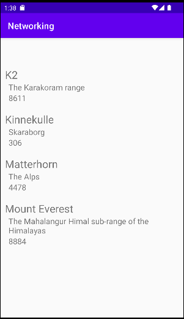

# Rapport

Först skapade jag en RecyclerView i layout filen activity_main.

Kodexempel 1
```
    <androidx.recyclerview.widget.RecyclerView
        android:id="@+id/recycler_view"
        ...
        />
```

Sedan skapade jag en layout fil som ska representera varje item i RecyclerViewen, med en vertikal LinearLayout
och 3 TextView element för Mountains Namn Location och Size. 

Kodexempel 2
```
<LinearLayout xmlns:android="http://schemas.android.com/apk/res/android"
    android:layout_width="match_parent"
    android:layout_height="wrap_content"
    android:orientation="vertical"
    android:padding="10dp">

    <TextView
        android:id="@+id/title"
        android:layout_width="match_parent"
        android:layout_height="wrap_content"
        android:text="Name"
        android:textSize="24sp" />

    <TextView
        android:id="@+id/location"
        .../>

    <TextView
        android:id="@+id/height"
        .../>
</LinearLayout>
```

Jag skapade sen en Java class kallad Mountain där jag genererade constructors,getters,setters och tostrings åt klassens
name, location och size parametrar.

Kodexempel 3
```
@SuppressWarnings("WeakerAccess")
public class Mountain {
    private String name;
    private String location;
    private int size;

    public Mountain(String name, String location, int size) {
        this.name = name;
        this.location = location;
        this.size = size;
    }

    @Override
    public String toString() {
        return "Mountain{" +
                "name='" + name + '\'' +
                ", location='" + location + '\'' +
                ", size=" + size +
                '}';
    }

    public String getName() {
        return name;
    }

    public void setName(String name) {
        this.name = name;
    }
    ...
```

Jag skapade sen en ny java class med namnet RecyclerViewAdapter som är en adapter med 
viewholders där jag definierade vad som ska skrivas ut i RecyclerView.

Kodexempel 4
```
...
@Override
public void onBindViewHolder(@NonNull RecyclerViewAdapter.ViewHolder holder, int position) {
    holder.title.setText(mountains.get(position).getName());
    holder.location.setText(mountains.get(position).getLocation());
    holder.height.setText(String.valueOf(mountains.get(position).getSize()));

}
...
public class ViewHolder extends RecyclerView.ViewHolder implements View.OnClickListener {
    TextView title;
    TextView location;
    TextView height;

    ViewHolder(View itemView) {
        super(itemView);
        itemView.setOnClickListener(this);
        title = itemView.findViewById(R.id.title);
        location = itemView.findViewById(R.id.location);
        height = itemView.findViewById(R.id.height);
    }
...
```

Sen deklarerade och initierade den nya Adaptern i MainActivity.

Kodexempel 5
```
        adapter = new RecyclerViewAdapter(this, mountains, new RecyclerViewAdapter.OnClickListener() {
            @Override
            public void onClick(Mountain item) {
                Toast.makeText(MainActivity.this, item.getName(), Toast.LENGTH_SHORT).show();
            }
        });
        view.setLayoutManager(new LinearLayoutManager(this));
        view.setAdapter(adapter);
```

Jag hämtade sedan Json datan från webbtjänsten Famouspeaks och parsade den med hjälp av gson till
min arraylist mountains och notifierade sen adaptern att datan hade ändrats.

Kodexempel 6
```
public void onPostExecute(String json) {
        Gson gson = new Gson();
        Type type = new TypeToken<List<Mountain>>() {}.getType();
        mountains = gson.fromJson(json, type);
        ...
        adapter.notifyDataSetChanged();
        ...
}
```



Figur 1 Slutresultatet av den skapade RecyclerViewen.

